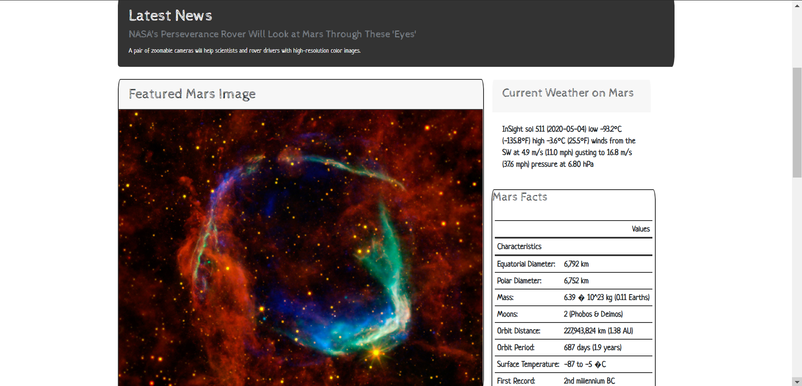
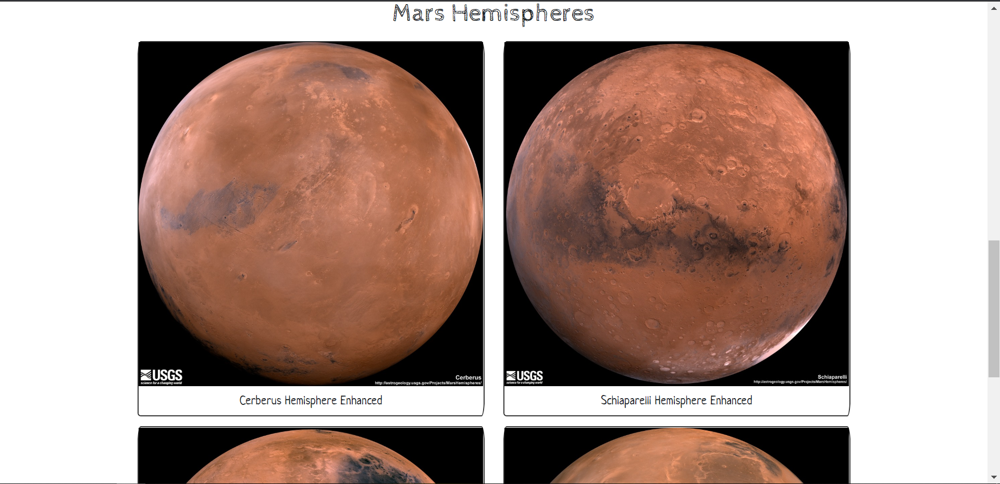

# Mission to Mars
Exploring web scraping using Beautiful Soup, Flask to scrape the internet and a non-relational DB (MongoDB) to store data such as news, featured images, weather, geographic information and twitter feeds about planet Mars

# Mars Page

# Mars Weather

# Latest News

# Mars Hemispheres in Pictures

